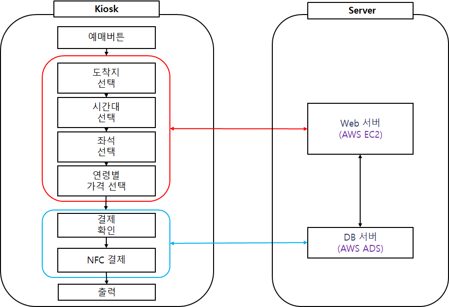

# :bus: 버스 예매 키오스크

군산대학교 It정보제어공학과 캡스톤 디자인  
클라우드 서비스와 NFC태그 결제를 이용한 키오스크

---


 </br>

* #### :family: 팀원
  * 정휘성, 김주하, 김예진, 이소현
  * Git Commit & Push
   
* #### 💻 Kiosk
  * Language & Environment: Python, Java
  * Pyqt5 / Tmoney 시외버스 API / NFC Tag / 카카오 API
  * UI: Pyqt5 + CSS   
  * 개발 팀원:
  
* #### :file_folder: Server
  * AWS EC2: 웹 서버 개발 팀원:  
  * AWS RDS: DB 서버 개발 팀원: 
  * Mysql 개발 팀원:
  
* #### 💡 구동 환경
  * Raspberry Pi 4(4GB)
  * OS Ver: Stretch 
  * Touch Screen: KLEINZ KP1401FTM 14Inch Portable Display or 한성컴퓨터 TFX133T
  * RC522 NFC Reader
  * IDE: Pycharm, Thonny, Pyqt5 Designer  

  
---


<!-------------------------------------------------------------Part 1------------------------------------------------------------------------------------------>

 ## 1. 블록도 설명
 <center>
     
 </center>

 1. 버튼 이벤트
     > 각 버튼 클릭 시 웹서버에 저장된 목적지, 시간, 좌석, 연령대별 가격 출력   

 2. 결제
     >  결제 확인 후 NFC Tag를 이용하여 결제
     >  결제 완료 정보를 DB서버에 저장 및 웹 서버에 반영
     
 3. 웹 서버
     >  목적지, 목적지별 가격 및 시간, 소요시간, 출발날짜, 좌석, 연령대별 가격 저장

 4. DB 서버
     > 미 결제 정보 및 결제 완료 정보 저장
 
 5. 출력
     > 카카오톡 알림 메시지 발송
     > QR코드 or 텍스트

 <!-------------------------------------------------------------Part 2------------------------------------------------------------------------------------------>
 ## 2. 개요 설명
 
 * **목적**
   > 노약자가 쉽게 사용할 수 있음  
   > 청구 운영시간 이후 사용 가능  
   > 청구 직원 유무 상관 없이 사용 가능   
   > 대면을 원하지 않은 사용자 또한 사용 가능   
   > 대기시간 절감 효과  

 * **키오스크 메인**
   > 
   <center>
        
   </center> 


 ---
 ---
 <!-------------------------------------------------------------Part 3------------------------------------------------------------------------------------------>
 ## 3. 핵심내용 설명
 
</br>

 NFC Tag  
 > 10 cm 이내의 근거리에서 무선 데이터를 주고받는 통신 기술  
 > 결제 및 도어락 등에 사용하고 있다
 
 AWS EC2(Elastic Compute Cloud)  
 >컴퓨팅 용량을 클라우드에서 제공하는 웹 서비스  
 >Linux / Windows 선택 가능  
 >머신러닝, 웹서버, 게임서버, 이미지 처리 등 다양한 용도에 최적화된 서버를 쉽게 구성 가능  

 Mysql  
 >관계형 데이터베이스 관리 시스템  
 >오픈소스, 다중 사용자 * 다중 스레드 지원  

 ---

 <!-------------------------------------------------------------Part 4------------------------------------------------------------------------------------------>
 
 ## 4. 핵심코드 설명  
 
 * **예매 버튼 이벤트  
 
 ```python
       # 추후 추가 예정
 ```
 <!-------------------------------------------------------------Part 5------------------------------------------------------------------------------------------>
 
 ## 5. 참고문헌
 
